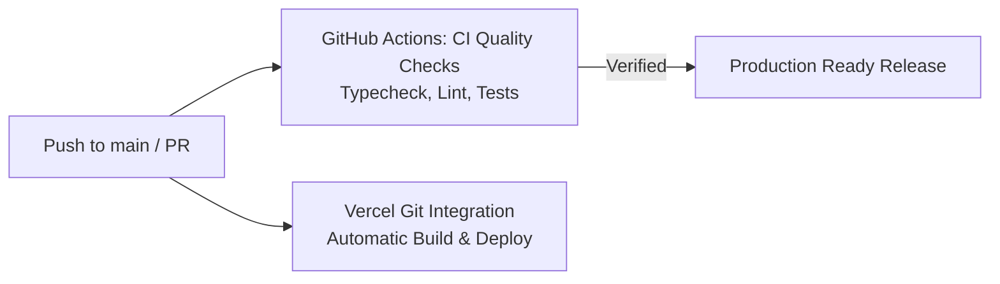

# Sift

A calm, minimal, mobile-first subscription and recurring payments dashboard PWA.

Sift helps individuals and independent creators track recurring services, upcoming renewals, free trials, normalized monthly/yearly run-rates, category breakdowns, and prune cancel candidates. Designed with peaceful, high-legibility surfaces inspired by Japanese stationery and oiled wood shelves—avoiding loud fintech gradients, bloated enterprise panels, and AI template tropes.

---

## 🎨 Theme Identities

- **Paper Ledger (Light Mode)**: Warm parchment surfaces, crisp charcoal typography, restrained moss-teal accents, and soft linen borders.
- **Night Shelf (Dark Mode)**: Low-glare midnight slate surfaces, soft bone typography, and luminous calm moss accents.

---

## 🛠️ Stack & Architecture

- **Framework**: [Next.js 15](https://nextjs.org/) (App Router, Server Components & Route Handlers)
- **Language**: [TypeScript](https://www.typescriptlang.org/) (Strict Mode)
- **Styling**: [Tailwind CSS v4](https://tailwindcss.com/) with semantic CSS token architecture
- **Testing**: [Vitest](https://vitest.dev/) (Deterministic unit tests for calculations & business logic)
- **CI / CD Automation**: GitHub Actions pipeline for automated test execution, dependency caching, and CI-gated Vercel deployment
- **Icons**: [Lucide React](https://lucide.dev/)
- **Database & Auth**: [Supabase](https://supabase.com/) (PostgreSQL with Row Level Security and per-user access policies)
- **Web Push**: Native browser push alerts via Service Worker and VAPID Web Push
- **PWA**: Mobile-first Web App Manifest, mobile viewport optimization, and touch target architecture
- **State & Data Access**: Unified `SubscriptionService` layer supporting seamless local reactive storage with graceful fallback and direct Supabase PostgreSQL integration

---

## 📁 Project Structure

```
Sift/
├── .github/
│   └── workflows/
│       └── ci.yml                   # GitHub Actions CI/CD workflow (tests, cache, Vercel deploy)
├── docs/
│   ├── PRODUCTION_READINESS.md      # Launch readiness checklist & smoke tests
│   └── ENVIRONMENT_SECURITY.md      # Vercel & environment variable security matrix
├── .env.example                     # Documented environment variables template
├── .gitignore                       # Clean Git exclusion rules
├── README.md                        # Documentation & setup guide
├── next.config.mjs                  # Next.js configuration
├── package.json                     # Dependencies and build scripts
├── postcss.config.mjs               # Tailwind v4 PostCSS setup
├── tsconfig.json                    # TypeScript path aliases (@/*)
│
├── supabase/
│   ├── migrations/                  # Versioned schema migrations
│   ├── seed.sql                     # System categories and seed data
│   └── README.md                    # Database setup notes
│
├── public/
│   ├── sw.js                        # Web Push & Service Worker handler
│   ├── manifest.webmanifest         # PWA manifest
│   └── icons/                       # PWA vector & scalable icons
│
└── src/
    ├── app/
    │   ├── (auth)/                  # Login & auth routes
    │   ├── (dashboard)/             # Overview, subscriptions, insights, settings
    │   └── api/                     # Push subscription, dispatch, and auth APIs
    ├── components/                  # UI, layout, subscriptions, insights, reminders
    ├── context/                     # Theme, Auth, Subscription, Notification contexts
    └── lib/
        ├── services/                # Subscription, push, and exchange rate services
        ├── types/                   # Domain interfaces & models
        └── utils/                   # Math, analytics, dates, annual optimization
```

---

## 🚀 Getting Started

### 1. Clone & Install Dependencies

```bash
git clone https://github.com/SanghpalBhakte/Sift.git
cd Sift
npm install
```

### 2. Run Locally

```bash
npm run dev
```

Open [http://localhost:3000](http://localhost:3000) in your browser.

---

## 🧪 Testing & Continuous Integration (CI)

### Running Tests Locally

Run the unit test suite with Vitest:

```bash
npm test
```

Or watch mode during active development:

```bash
npx vitest
```

---

## 🚢 CI/CD & Deployment Automation

Sift utilizes a unified GitHub Actions pipeline ([`.github/workflows/ci.yml`](file:///.github/workflows/ci.yml)) with automated testing and **Vercel** deployment.

### Why Vercel?
Vercel is the native runtime platform for Next.js 15 App Router, Server Components, and Edge/Node Route Handlers (`/api/push/*`, `/api/reminders/dispatch`). It requires zero custom build adapters or edge runtime polyfills.

### Deployment Gating & Workflow Architecture



1. **GitHub Actions CI (`quality`)**: Runs `npm run typecheck`, `npm run lint`, and `npm test` on Node.js 20 with npm dependency caching.
2. **Vercel Native Deployment**: Automatic build and deployment directly via Vercel's official GitHub integration, supporting native Deployment Checks for `lint` and `typecheck`.

### Production Environment Variables (Set in Vercel Dashboard)

Configure these environment variables in your Vercel Project Settings:

- `NEXT_PUBLIC_SUPABASE_URL`: Supabase project URL.
- `NEXT_PUBLIC_SUPABASE_ANON_KEY`: Supabase anonymous client key.
- `SUPABASE_SERVICE_ROLE_KEY`: Supabase service role key (for server-side push/reminder dispatch).
- `NEXT_PUBLIC_VAPID_PUBLIC_KEY`: Web Push VAPID public key.
- `VAPID_PRIVATE_KEY`: Web Push VAPID private key.
- `VAPID_SUBJECT`: Mailto contact for Web Push (`mailto:support@sift.app`).
- `RESEND_API_KEY`: Resend API key for transactional emails.
- `CRON_SECRET`: Secret header token for triggering `/api/reminders/dispatch`.

---

## 📋 Production Readiness & Launch Checklist

For complete pre-launch verification, environment audits, and the 9-step launch-day smoke test, refer to the [Production Readiness Guide](file:///docs/PRODUCTION_READINESS.md).

---

## 🚀 Continuous Deployment

Sift features continuous integration and automated deployment with GitHub Actions and Vercel. Every commit to `main` executes the unit test suite and automatically deploys a verified prebuilt release.

---

## 📄 License

MIT © Sift
