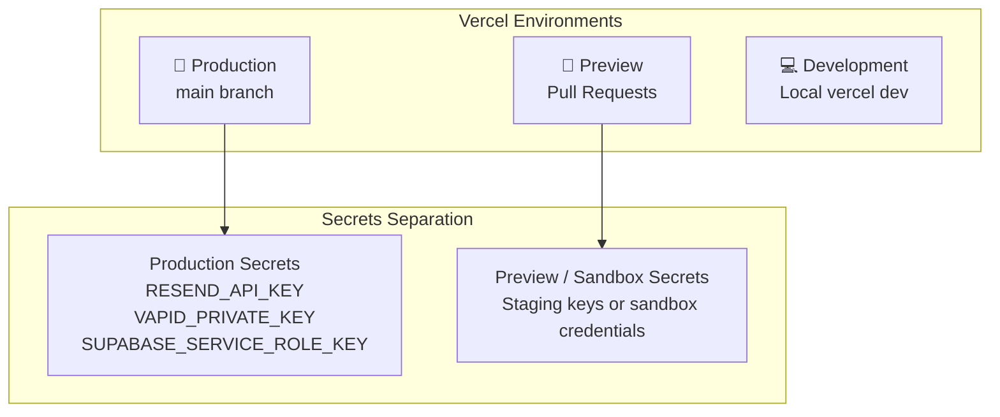

# Sift — Environment Variables & Vercel Security Architecture

This document details the security classification, scoping rules, and operational handling of all environment variables across Sift's local, preview, and production environments.

---

## 1. Environment Variable Audit & Classification Matrix

| Variable Name | Client vs. Server | Scope / Environments | Purpose | Risk Classification & Handling |
| :--- | :--- | :--- | :--- | :--- |
| `NEXT_PUBLIC_SUPABASE_URL` | **Public** (Browser & Server) | Development, Preview, Production | Supabase project API gateway endpoint | **Low Risk** · Publicly visible in HTTP network requests. Protected by PostgreSQL Row Level Security (RLS). |
| `NEXT_PUBLIC_SUPABASE_ANON_KEY` | **Public** (Browser & Server) | Development, Preview, Production | Anonymous JWT token for client-side queries | **Low Risk** · Safe for client-side embedding. Strictly limited by user session RLS policies. |
| `SUPABASE_SERVICE_ROLE_KEY` | **Server-Only** (Secret) | Production (and Staging if needed) | Elevated database admin & background worker access | **CRITICAL SECRET** · NEVER prefix with `NEXT_PUBLIC_`. Must only be read inside server functions (`/api/*`). |
| `NEXT_PUBLIC_APP_URL` | **Public** (Browser & Server) | Development (`http://localhost:3000`), Preview (`https://*.vercel.app`), Production (`https://sift.app`) | Root URL for email links and auth redirects | **Low Risk** · Used for constructing canonical URLs and email deep links. |
| `RESEND_API_KEY` | **Server-Only** (Secret) | Production | API credential for sending transactional renewal alert emails | **HIGH SECRET** · Server-only. Only accessed within `/api/reminders/dispatch`. |
| `RESEND_FROM_EMAIL` | **Server-Only** | Production, Preview | Verified email sender identity (e.g. `alerts@sift.app`) | **Low Risk** · Server-side configuration for email header formatting. |
| `NEXT_PUBLIC_VAPID_PUBLIC_KEY` | **Public** (Browser & Server) | Development, Preview, Production | Base64 public key for browser PushManager subscription | **Low Risk** · Public cryptographic key used by browser to register Web Push endpoints. |
| `VAPID_PRIVATE_KEY` | **Server-Only** (Secret) | Production, Preview | Cryptographic private key for signing Web Push alert payloads | **CRITICAL SECRET** · Server-only. Used exclusively by `webpush.setVapidDetails()` on the server. |
| `VAPID_SUBJECT` | **Server-Only** | Production, Preview | Contact mailto URI required by the Web Push protocol (`mailto:support@sift.app`) | **Low Risk** · Server-side metadata required by VAPID specifications. |
| `CRON_SECRET` | **Server-Only** (Secret) | Production | Bearer token authorization for automated background cron dispatch | **HIGH SECRET** · Protects `/api/reminders/dispatch` from unauthorized external execution. |

---

## 2. Vercel Environment Scoping Strategy

Vercel provides 3 distinct deployment scopes for environment variables:



### Scoping Rules:
1. **Production-Only Secrets**:
   - Scope `SUPABASE_SERVICE_ROLE_KEY`, `RESEND_API_KEY`, and `CRON_SECRET` to **Production** (or dedicated Staging).
   - This ensures pull requests from external branches or preview builds do not inadvertently trigger production actions or access live customer data.
2. **Public Configuration Across All Scopes**:
   - `NEXT_PUBLIC_SUPABASE_URL`, `NEXT_PUBLIC_SUPABASE_ANON_KEY`, and `NEXT_PUBLIC_VAPID_PUBLIC_KEY` are safely enabled for **Production, Preview, and Development**.
3. **Dynamic App URL (`NEXT_PUBLIC_APP_URL`)**:
   - **Production**: `https://your-custom-domain.com`
   - **Preview**: Automatically resolved via `https://${process.env.VERCEL_URL}` if omitted, or left unset.
   - **Development**: `http://localhost:3000`

---

## 3. Supabase Security & RLS Policy Confirmation

- **Anon Key vs. Service Role Key**:
  - The `NEXT_PUBLIC_SUPABASE_ANON_KEY` is client-safe because all database tables enforce PostgreSQL **Row Level Security (RLS)**.
  - Queries made with the anon key only return rows where `auth.uid() = user_id`.
  - The `SUPABASE_SERVICE_ROLE_KEY` bypasses RLS and is only used server-side in API route handlers for administrative tasks.
- **Redirect URL Configuration**:
  - In the Supabase Dashboard under **Authentication > URL Configuration**:
    - **Site URL**: `https://your-production-domain.com`
    - **Redirect URLs**:
      - `http://localhost:3000/auth/callback`
      - `http://localhost:3000/api/auth/callback`
      - `https://your-production-domain.com/auth/callback`
      - `https://your-production-domain.com/api/auth/callback`
      - `https://*.vercel.app/auth/callback` (Wildcard for preview deployments)

---

## 4. Security Audit Findings & Fixes Applied

1. **Eliminated Hardcoded VAPID Fallback Keys**:
   - *Previous state*: `serverPushService.ts` and `pushNotificationService.ts` contained hardcoded fallback VAPID key strings.
   - *Fix applied*: Removed all hardcoded cryptographic fallback strings; replaced with strict runtime environment variable checks and graceful warning logs.
2. **Secured `/api/reminders/dispatch` Endpoint**:
   - *Previous state*: Required active user session cookie.
   - *Fix applied*: Added `CRON_SECRET` Bearer header authorization to allow automated serverless cron triggers while maintaining strict 401 unauthorized protection against public crawling.
3. **Verified Zero Public Prefix Leaks**:
   - Verified that no sensitive service keys (`RESEND_API_KEY`, `VAPID_PRIVATE_KEY`, `SUPABASE_SERVICE_ROLE_KEY`, `CRON_SECRET`) use the `NEXT_PUBLIC_` prefix.
4. **Centralized Schema-Validation & Route Preflight**:
   - `src/lib/env.ts` provides typed, validated getters (`getServerEnv()`, `getPublicEnv()`) and service integration checks (`serviceStatus`).
   - `next.config.mjs` executes automated build-time environment audits on startup.
   - `/api/reminders/dispatch` returns a `503 Service Unavailable` machine-readable JSON error if `RESEND_API_KEY` is not configured, avoiding silent runtime errors.

---

## 5. Setting Up Environment Variables in Vercel

### Option A: Via Vercel Web Dashboard (Recommended)
1. Open your project on [vercel.com](https://vercel.com).
2. Go to **Settings > Environment Variables**.
3. Add each variable and select the appropriate environment checkboxes (**Production**, **Preview**, **Development**).

### Option B: Via Vercel CLI
```bash
# Add a production-only secret
vercel env add RESEND_API_KEY production

# Add a public variable to all environments
vercel env add NEXT_PUBLIC_SUPABASE_URL production preview development

# Pull variables to local .env.local for development
vercel env pull .env.local
```
